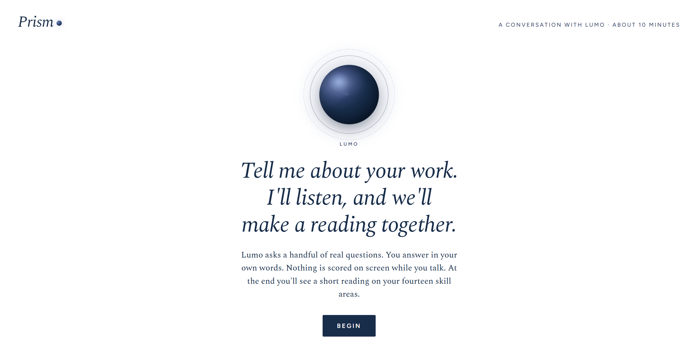
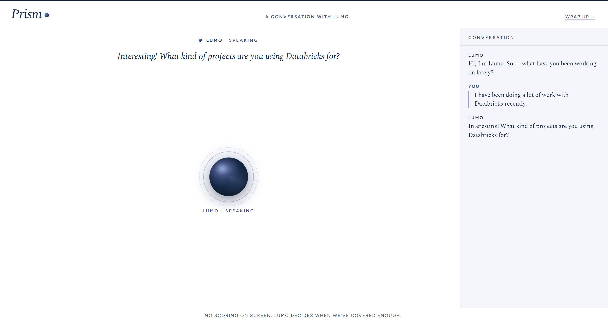
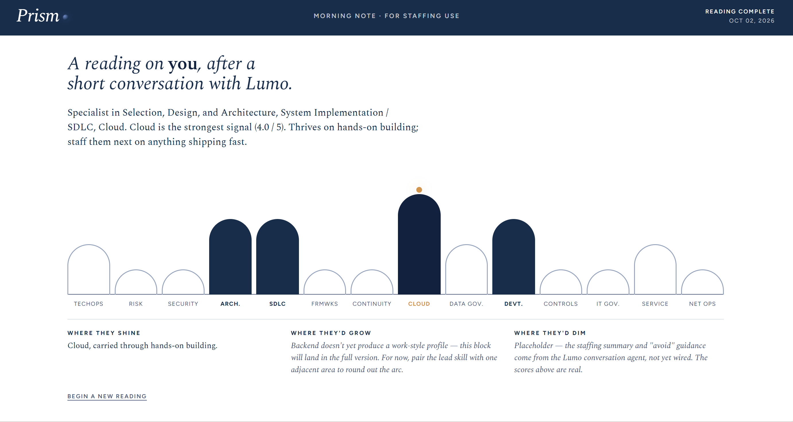
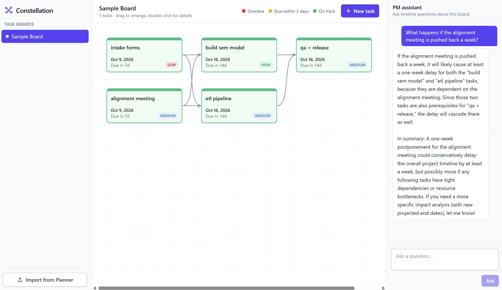

# General Info

Two projects: constellation and prism
See subfolders for more info

## Prism - A smart interview platform 

MVP: Allows the user to give a work update to Prism through a conversation, which generates a 
skills profile. Future versions could integrate this profile with PeopleSearch.

## Constellation - A graph-based task tracker

MVP: Allows import from Microsoft Planner exports, can then add tasks to a task board, organize them
based on dependencies, and ask plain english questions to an Agent to help project management.

